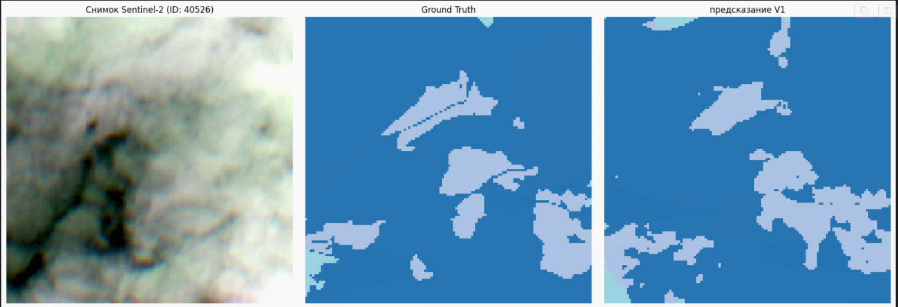
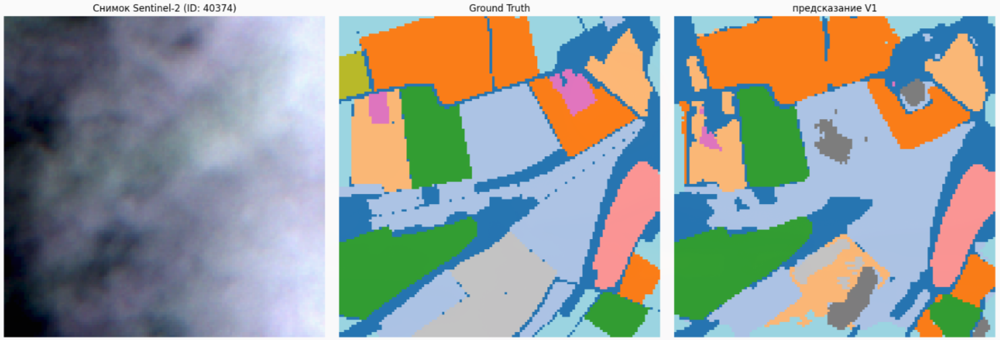
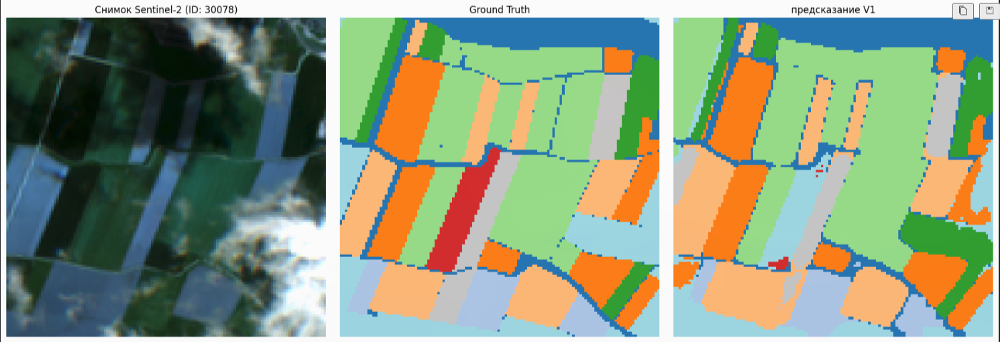
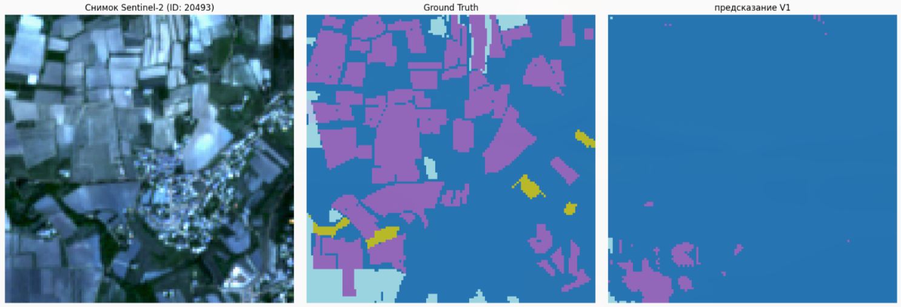
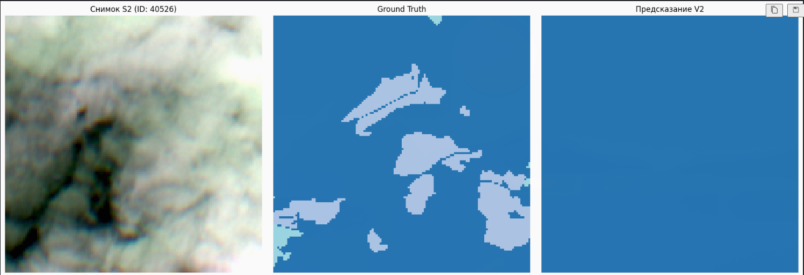
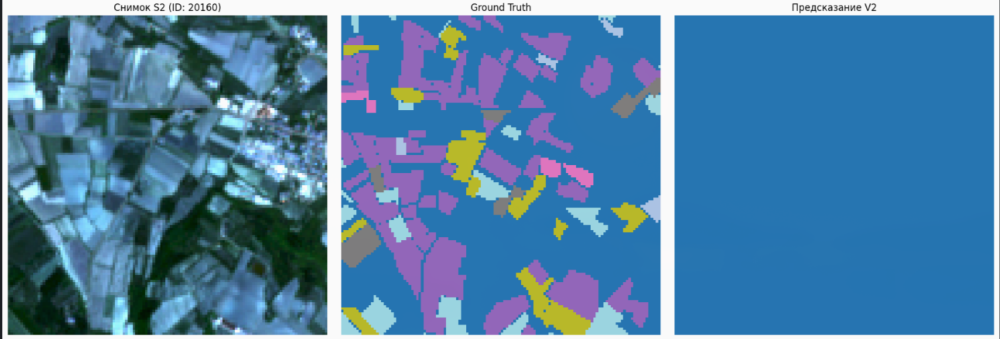

# Репорт моей проделанной работы

## Моя цель - Semantic Crop Segmentation
Я нашел датасет под названием Pastis, он сделан спутником Sentinel-2. В нем сделаны снимки полей за целый год, то есть мы имеем состояние полей за все сезоны (при этом в каждом сезоне снимки были сделанны не раз). Наш тензор выглядит следующим образом: (38, 10, 128, 128).
- 38 (Временные метки) - сколько раз спутник пролетел над полем за сезон.
- 10 (Спектаральные каналы) - это значит что снимки не просто RGB, а так же имеют и другие каналы, как например NIR (ближний инфрокрасный) и Red Edge. Растения как раз отражают эти цвета в зависимости от их здоровья и типа.
- 128х128 (Это размер каждого снятого снимка с полями) - площадь примерно 1.3 на 1.3 км.
Так же сами маски имеют три слоя (Semantic Segmentation, Instance Segmentation, Boundary/Edge Mask). Нас будет интересовать первый слой, так как именно он нужен нам для классификации типа растительности на поле. К примеру: 0 это фон, 1 это пшеница, 2 это кукуруза. Модель будет учится предсказывать именно этот слой.

## Модель - U-TAE (U-shaped Temporal Attention Encoder)
Я выбрал модель по двум основным причинам. Первая: в модели есть функция L-TAE (Lightweight Temporal Attention Encoder). Что значит модель сможет понимать что если поле на снимке в апреле коричневое, в июле ярко зеленое и скажем в сентябре золотистое то это пшеница. Так же функция attention. Модель сможет решать какой месяц важнее для определённой культуры. Как например для подсолнуха это был бы август. Вторая причина: это U-Shape помогает нам справляться с сжатием картинки и возвращением контуров в обратное состояние.

## Две версии модели
### Версия 1. Accuracy 74%. 15 эпох

### Версия 2. Accuracy 100%. 30 эпох. Но там была ошибка, поэтому результаты пустые.

